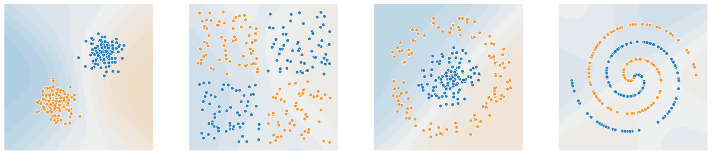

# No code, No maths - Learn GenAI
This is a tutorial to Neural Networks and Generative AI

**Ever wonder how chatbots work?** You know, those virtual assistants always ready to answer your questions? Let's dive in without any intimidating math or coding!

For this we will proceed in 3 steps:

1.	We will use a playground to "no-code" build and run a neural network. We see how it "learns" a task. Neural networks are the bricks and mortar of computer vision, of image generators and of natural language processing (NLP). NLP is the basis of chatbots.
2.	Then we'll watch a 25-minutes "no-maths" video from Harvard University explaining how computers "talk" to each other, using special math tricks called "Transformers." Think of it like translating languages, but for computers! This helps them understand and respond to our words, making chatbots more natural.
3.	By combining these building blocks and language skills, we get chatbots! But remember, there's no magic or real intelligence involved. It's like a complex machine trained to respond in specific ways. This knowledge helps us appreciate what chatbots can do (answer questions, translate languages) and what they cannot (think for themselves, solve complex problems).

So, there you have it! A basic understanding of chatbots without any scary technical stuff. Remember, knowledge is power, and knowing how something works makes it less intimidating and more fun!

## 1. Graphically Build & Run a Neural Network 
Imagine a website where you can play with mini-brains that can learn! With it you can build and train neural networks to discriminate between 2 datasets. These pairs are more or less difficult to discriminate, so your neural network will also be more or less complex.

You can play around on your own, but this is a guide to help you get started.

This is the web site: https://playground.tensorflow.org/ The screenshot below shows the home screen. Let's have an overview of the actions that are possible on this playground.

1.	**choose 1 of the 4 input data sets**: There are 4 squares filled with tiny dots, like colored pixels. We pick one square (it's brighter!) and feed it to a smart program. This program learns to separate blue and red dots, assigning to each color its own area. Cool, right?
2.	**choose how the input data is preprocessed**: Each pixel of the input square on the far left is preprocessed and fed to the first layer. 
-	"x1" and "x2" simply multiply the input by a weight. 
-	"x1^2" and "x2^2" square the input before multiplying it by a weight. 
-	"x1 x2" multiply together the coordinates of input and the result is multiplied by a weight.
-	"sin(x1)" and "sin(x2)" calculate the sine of the coordinates of each input and multiply it by a weight.
3.	**set the hidden layers and populate the layers**: build a network of interconnected squares, where each square represents a brain cell. You can adjust the number of squares in each layer and the connections between them to fine-tune the network's performance.
4.	**reset, train & test the neural network**: We see 3 buttons.

- the reset button initiates randomly the preprocessing and the weights of all connections between brain cells.
- the run button starts the magic part of the neural network. It uses the TensorFlow library to train the neural network. You can pause and restart the training.
*Our machine learns by playing a guessing game. It gets clues (connection weights) and tries to guess if the answer is "blue" or "red". If it guesses wrong, it learns from its mistakes and adjusts its guesses next time. This "learning" happens by changing the connection weights between its brain cells. The more it practices, the better it gets at guessing correctly!*
- the step button does the training step-by-step.

**5.	see the loss function and discrimination**:

Additional note:

-	In our artificial brain, stronger connections are thicker. We can shrink this brain by removing weak connections, like unimportant shortcuts, without losing much information. This is how we make big language models smaller and faster! In jargon, they call this process LoRA (Low Rank Adaptation).

Now let's start the exercises.

### 1.1	Simplest discrimination
This simplest discrimination involves two clearly distinct datasets. In the playground (https://playground.tensorflow.org/) do as indicated in the drawing below. It is the simplest neural network: it has 2 linear preprocessing combined into one single brain cell (neuron). The learned discrimination is very good.

Exercises:
-	Try with only one input preprocessing square. Observe that the discrimination is not good. This means that good discrimination requires at least two orthogonal dimensions.
-	Add another hidden layer. Reset and run. Observe that discrimination is not better. Increase the neurons in the layers. Not better discrimination. Our first try hit already the optimal neural network.

### 1.2	Increase Pattern Complexity: disjoint groups
The first exercise above discriminates two sets where dots within each group are close together. The following exercise uses two sets where the groups themselves are completely separate.
-	Try with the above one-layer neural network. Reset, run and observe that the loss function is high for both the training set and the test set (0.38-0.4), which means bad discrimination.

-	Add a hidden layer. Reset, run and observe that the loss function is still bigh.

- Add two neurons to the inner layer, for a total of 3 in this layer. Reset, run and observe the result. Observe that this more complex inner layer clearly improves the discrimination.

-	Observe that all neuron connections in the hidden layer are thick: they participate in the output. This means that the neural network is optimal. The 3rd neuron of the inner layer is also important because its output contributes with an important weight to the output layer.
-	Try adding more neurons to the inner layer, for a total of 4, 5, 6 and 7 in this layer. Reset, run and observe that a more complex inner layer barely improves. Try and change "ratio of training to test data". Observe that at high ratios the training becomes unstable: the loss function oscillates from one iteration to another.
-	In the input preprocessing, use parabolic functions (x^2^ and y^2^). Observe that whatever the complexity of the neural network (number of layers and number of neurons par layer), discrimination is weak. Conclude on the importance of choosing the correct input preprocessing function.

-	In the input preprocessing, use the hyperbolic functions (x1x2). Observe that the discrimination is now excellent even with the simplest neural network configuration. Change the ratios of training to test data and observe that convergence is always stable: the training doesn't depend on the sampling errors. Conclude again on the importance of choosing the correct input preprocessing.

Exercises:
-	Try a complex configuration with 2 hidden layers and 4 neurons in each. Reset, run. Hover the cursor over the weights and observe that only one neuron in each layer contributes to the discrimination, the other weights are noise and the neurons can be disregarded. This is a hint how the size of LLMs can be reduced, for example with LoRA and with LASER: identify the neurons with low weights and ignore them.
-	LoRA readings (maths inside): https://www.ml6.eu/blogpost/low-rank-adaptation-a-technical-deep-dive, https://huggingface.co/docs/diffusers/v0.19.2/training/lora
-	LASER readings (maths inside): https://multiplatform.ai/introducing-laser-mit-and-microsofts-game-changing-approach-to-optimizing-large-language-models/

### 1.3	Discriminate task: Inclusion Pattern 
Brain-like AI recognition systems excel at untangling messy puzzles, especially when hidden shapes nestle within each other. Choose the dataset shown here:
-	In the input preprocessing functions, choose the parabolic functions ("x12" and "x22"). Define a simplest neural network configuration with 2 hidden layers, 1 neuron in each layer. Reset, run and observe that the discrimination is perfect.

- Try with more complex neuron configurations and observe that the performance is not better.
-	We notice again the importance of using an adequate pre-processing function for the input layer. The square function performs better than the linear function. This is why, in computer vision, a choice of convolution filters is applied to preprocess the input and extract shapes and boundaries on which the training is done.

**Additional notes:** 

There is more than one combination of neural network pre-processing and configuration that can be used to discriminate the 2 datasets. For example, instead of the parabolic preprocessing we can use linear preprocessing and compensate with a more complex hidden layer. 
-	For input preprocessing, choose the linear functions ("x1" and "x2"). Define a neural network with 2 hidden layers, 3 neurons in inner layer and 2 neurons in the output layer. Reset, run and observe that the discrimination is quasi perfect.
-	Reset and run again to check that the good discrimination is consistently achieved.

We have a hint here how "hallucinations" appear in chatbots: it's like teaching a parrot two ways to speak. Both sound good to the parrot because it only knows its training phrases. But for someone who understands language, one way might sound nonsensical, like the parrot making up words. That's similar to how chatbots can sometimes create realistic sounding but incorrect responses based on their limited training data.
### 1.4	Discriminate task: Swirling Pattern 
Let's choose the pair of datasets as two swirling clouds of data, tightly linked. Complex as it gets!
-	For the input preprocessing, select all functions including sine and cosine. Define a neural network configuration with 2 hidden layers, 7 neurons in the internal layer and 1 neuron in the output layer. Reset, run and observe that the discrimination is perfect, albeit after a long training.

-	Observe that all input preprocessing connections to the hidden layer are thick and all neurons in this hidden layer also have thick connections to the output. This means that the neural network is optimal, although training takes a lot of iterations before converging.
-	Repeat with a configuration having 7 neurons in the output layer. Observe that training convergence is faster.

The following experiment will give us several interesting hints on how to design neural networks.
-	Select only the 2 linear preprocessing functions ("x1" and "x2"). 
-	Define a fully complex neural network with 6 hidden layers, each with 7 neurons. 
-	Reset and run for a long moment. The training will converge after an instable period.
-	Observe that the training discriminates very well the 2 datasets despite the whirling pattern. As successful as if we used all preprocessing functions available.

-	Keep the same network. but use the ReLU (Rectified Linear Unit) activation function. Training converges with less iterations and faster. The ReLU activation function is faster to compute than the hyperbolic tangent (tanh) function.

## 2	What we have learned from the playground
Main take-aways:
1.	Imagine information flowing through a network of interconnected cells, each performing simple calculations. This simplified picture captures the essence of a neural network, a powerful tool used in machine learning.
2.	Each cell, called a neuron, receives information from its neighbors, multiplies it by a factor (weight), and combines the results. This combined value then gets transformed by an activation function, determining the neuron's output that feeds the next layer.

3.	The ReLU activation function is popular because it's efficient and mimics the behavior of brain cells. Think of it like a filter, letting through only positive signals.
4.	By stacking many layers of interconnected neurons, we create a fully connected neural network. With enough layers and neurons, even simple networks can learn complex patterns. However, too many connections become cumbersome, requiring powerful computers to train.
5.	To improve efficiency, some networks like those used for image recognition employ convolutions, a special type of connection that focuses on local features.
Here's where things get interesting: 
6.	A real-life network, containing a thousand of neurons in each layer, has 1 million weights between 2 layers. With 1 thousand layers (hence the term "deep learning"), that makes a billion weights. This is why very powerful GPUs (floating point calculators) are required to train it.
7.	Imagine connecting several of these single networks, creating a system like the Transformer, used in chatbots and image generation. The set of connections and weights in this system, called the model, can contain billions of parameters!
8.	Transformers are used in Large Language Models for chatbots and in Diffusion Models for image generation.

The above experiment required no maths and no code. To understand further the current developments in AI, we need some maths and some coding. This is why the following is composed of YouTube videos and scientific articles. The knowledge gained from the experiments above will help us understand the explanations.

## 3	Recurrent Neural Network
Recurrent Neural Network is an architecture of neural networks used to process sequences of data. It is explained in https://youtu.be/J1QD9hLDEDY?t=5222. It is a very good transition to understand Transformers, that are the basis of current Large Language Models that power chatbots, and Diffusion Models that power image generators.
-	Until now, we have seen Feed-Forward Network (single shot): one-shot input => output
-	Recurrent network (loop back) network: unbounded stream of inputs => corresponding output stream

## 4	Understand Transformers 
https://www.youtube.com/watch?v=QAZc9xsQNjQ&t=2434s
This CS50 video lesson (25 minutes) from Harvard University gives an excellent explanation about transformers and Generative AI. It explains the following topics:
-	Encoder-decoder architecture,
-	Attention on a segment of tokens,
-	Attention + Positional encoding = Transformers,
-	Transformers in Generative AI.

This CS50 course stops short of distinguishing between Large Language Models, used for text generation, and Diffusion models, used for image generation.
Concerning the Diffusion Models, I haven't found any easy-to-understand courses. The following resources give some useful explanations:
-	illustrated explanation, starting with easy concepts and becoming more and more abstract; watching this makes less steep the understanding the following ones: https://youtu.be/sFztPP9qPRc
-	papers & math explaining the foundation scientific article, more maths than the previous video but it complements well because it is more concrete: https://youtu.be/HoKDTa5jHvg
-	explanation of the same article, same maths level, but presented differently: https://youtu.be/W-O7AZNzbzQ

## 5	Convolutional Neural Network
#### 5.1	Convolutional Neural Network Overall Principle
The playground exercise above demonstrated how pre-processing an input signal facilitates a neural network to recognize a spiral pattern. It also shows that while learning can be achieved using a brute force neural network (only linear inputs), doing so requires a lot more cells than learning using adequate input pre-processing.
Convolutional neural networks proceed from this remark to learn images in computer vision where a high number of pixels is already involved. They pre-process the input before feeding a neural network. They first identify shapes, borders, patterns with convolution transforms, and feed a neural network with these results, making less neurons to involve and therefore faster learning.

If you want to know more, here is an excellent video lesson from Harvard University on convolutional neural networks (CNN): https://youtu.be/J1QD9hLDEDY?t=3490. The main actions are:
-	Apply a convolution filter to detect shapes, boundaries and patterns,
-	Repeat convolution and pooling a number of times, each convolution with a different filter,
-	Pool the pixels (replace each square of 3x3 pixels by one single pixel containing the max of all 9, for example), to reduce their number,
-	Feed the pixels to a neural network,
-	The lesson ends with a Python programming example, using a pre-trained library for digit recognition.

This is the basic building block of a CNN.

### 5.2	CNN Image Processing Use Cases
In CNNs used for image processing, several types of 3x3 filters are used and their coefficients are part of the neural network training. For example:

**Example 1: Image Classification CNN**
The example in Harvard the video above used a CNN to classify handwritten digits (0-9). The convolutional layer processes a 27x27 grayscale image of a digit. Here's a potential set of filters:
-	Edge detectors (horizontal, vertical, diagonal): Capture basic edges forming the digit shape.
-	Corner detectors: Identify key junctions where lines meet.
-	Line thickness detectors: Differentiate between thin and thick strokes.
-	Curvature detectors: Capture round or curved segments of the digit.
-	Texture detectors: Extract information about pixel intensity variations within the digit.

The specific number and variations of these filters can vary depending on the network architecture and desired performance. Once filtered, the 27x27 matrix is reduced (pooled) to a 9x9 matrix that feeds the learning neural network to recognize the digit.

**Example 2: Medical Image Segmentation CNN**
Suppose a CNN segmenting tumors in brain MRI scans. The convolutional layer processes a 3D image volume. Here's a possible set of filters:
-	Intensity difference filters: Differentiate between high-intensity tumor regions and lower-intensity healthy tissue.
-	Texture filters: Capture the characteristic texture patterns of tumors versus normal tissue.
-	Boundary filters: Identify sharp edges delineating the tumor region.
-	Smoothness filters: Enhance continuity within the tumor region while suppressing noise.
-	Spatial orientation filters: Capture the 3D spatial distribution of the tumor.

Again, the exact combination and types of filters depend on the specific task and data characteristics.

### 5.3	Seeing Road Signs with AI Eyes: A Simplified Look
Imagine a robot car trying to understand traffic signs. That's where Convolutional Neural Networks (CNNs) come in!
Think of a CNN as a series of "boxes" stacked one after another. Each box holds smaller boxes called filters, like tiny detective glasses. Their job? To scan the image, looking for specific patterns.

In our example below, we have 3 boxes:
-	**Detail Detective**: This box has filters that spot small things like numbers. It might find the digits "8" and "0".
-	**Digit Decoder**: This box uses larger filters, combining smaller patterns like "8" and "0" into something bigger, like the number "80".
-	**Shape Sleuth**: This box has even bigger filters, looking for the overall shape of the sign. In this case, it finds the telltale red circle of a speed limit sign.

But how do these boxes get smarter? Here comes the training:
1.	We show the CNN lots of labeled pictures of road signs.
2.	It tries to guess what sign it sees.
3.	If it's wrong, we tell it the error.
4.	Like a student learning from mistakes, the CNN adjusts its filters to get better at recognizing patterns.

The more it practices, the better it gets at seeing different signs, even in different lighting or angles. This helps robot cars understand the road, making them safer and smarter!

Remember:
-	Each box does a specific job: finding small details, combining them, and seeing the overall shape.
-	Training helps the CNN learn by adjusting its filters.
-	This helps AI "see" and understand road signs!

This simplified explanation keeps the core concepts of CNNs for road sign recognition, making it easier to grasp!

## 6	Quantization and Low Ranking Adaptation
Raw AI models have hundreds of billions of parameters. We'll see as a last step the techniques used to reduce the memory requirements to run these models.
https://youtu.be/t509sv5MT0w

## 7	Use Case: Hands-on OpenAI text embeddings coding
This tutorial concludes with a 18-minutes video showing how to store and compare personal profiles made of sequences of text. This is how, in the humanitarian project Machu Picchu, persons-in-need can share their profiles and obtain focused assistance, either from humanitarian organizations or mutually between persons sharing a similar profile.
https://www.youtube.com/watch?v=ySus5ZS0b94

